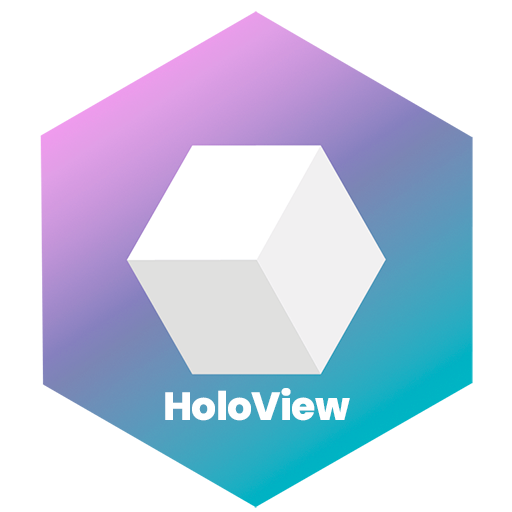

# HoloView 
|  |  |
| :-------: | :-------------------------------------------------------- |

**Team members**
 - Kasmir Lehto : kasimir.lehto@realitycrisis.io
 - Igor Dmytrus : igor.dmitrus@realitycrisis.io
 - Csaba Bolyós : bladeszasza@gmail.com
 - Vlad Pereverziev : vladyslav.pereverziev@realitycrisis.io
 - Nathan Lienau : nlienau1@gmail.com

## Description
We believe there is a high demand for better interaction between digital assets, NFTs, and their owners. [Reality Crisis](https://realitycrisis.io/) believes AR is the answer, and we want to help bridge the gap. 

**HoloView** is a mobile application for Android and IOS that allows users to view all LSP8 based assets stored under a Universal Profile in augmented reality. Users can open a Universal Profile bring their assets into an AR environment, place, scale, rotate them to a desired position, and then save the location of those assets in space to be re-called at any time. 

HoloView is a personal AR NFT gallery creator that gives the user more tangible ways to enjoy and show off their NFT collection. You could think of it as an immersive wallet.

## Video Presentation 
https://youtu.be/cJf2NiP6rOM

## Architecture 
Holoview is composed of three main parts the Unity build, Reality Crisis backend, and the L16 test net. 

- The Unity build for HoloView is capable of "scanning" an enviroment using `AR Scan` producing x,y,z planes and coordinates allowing the user to place digital assets in an augmented reality enviroment. Once these planes have been produced you are able to load digital assets onto a set coordinate and `anchor` them to the scene. Anchoring points are described with image processing algorithms and produces a vector of features. The array of these vectors describes our scene and are saved to our device under a chosen name. When the user re-launches the application and selects the saved anchor they want to recall the `load` function recalls the array of these vectors. If the vectors match, the scene is recreated within the x,y,z coordinating system.

- The Reality Crisis backend is a middle layer between the Holoview application and the L16 testnet. This middle layer allows us to recall data from the L16 test net and IPFS servers including LSP3, LSP4, and LSP8, assets and metadata. We have also produced a number of utility API calls for this middle layer making functions like creating a Universal Profile, deploying an LSP8 contract, and minting assets much easier. 

- The L16 testnet is Luksos ecosystem containing the assets, profiles, and contracts being called by Holoview. The most important elements for this build are the Universal Profile which acts as the account connecting to Holoview, and the LSP8 Contracts which contain the link to the assets and data for objects in Holoview. 

## Build Documentation 

 - [Back End Documentation ](https://realitycrisis.atlassian.net/wiki/spaces/HOL/pages/2038235137/Backend+layer)
 - [Hollow View Documentation](https://realitycrisis.atlassian.net/wiki/spaces/HOL/pages/2041970692/Holoview+app) 

## Try Holoview 
An invitation to use the Holoview IOS version through Testflight has been sent to 
 - jonathan@lukso.io 
 - callum@lukso.io 
 - jakeprins@outlook.com 
 - yamen@lukso.io 
 - fabian@futureagency.io 
 - hugo@lukso.io 
 - jean@lukso.io 
 - marjorie@lukso.io

The invitation will invite you to download Testflight from the App store. Once Testflight is installed please login using that same email account. Once you have logged in a second email invitation will come from Testflight inviting you to the current HoloView build.

[Link to Android version](https://drive.google.com/drive/folders/1Qf_gKMLAoa_2-LYODVDs563OjywI0EFs?usp=sharing) 

## UI Walkthrough 

 - `Profile`: View your Universal Profile and metadata linked to Universal Profile 
   - `Go To Collection`: Opens tab showing all NFTs under your Universal Profile 
     - Inside this tab select the NFTs you want to bring into your scene 
 - `Collection`: View the same tab containing NFTs for selection 
 - `AR Scan`: Scan your enviroment and genereate planes/ coordinates for assets to sit on 
 - `NFTS`: Opens secondary wheel of selected NFTs to bring into the scene 
   - tap left and right to scroll through selection 
   - drag and drop assets into the scene
   - pinch to scale, twist to rotate
   - if asset has been placed use crosshairs and wrench to `move`, `scale`, and `rotate` 
 - `Anchor`: Lock asset to coordiante at current placement, rotation, and scale. 
   - Name and Save Anchor to recall at another time 
   - `Load`: Recall previously saved anchors 
 - `Record`: drops UI and begins screen recording scene. Press "Lukso" text at bottom to end recording. 

 ## Known Bugs and Limitations 
 - The current mobile version does not have a "sign in sign out" function for Universal Profiles. The Universal Profile included with the build is coded into the application. Information regarding this account can be found in our Confluence page.
 - The current version has a bug when trying to move, scale, add new assets to an anchor that is loaded from anchor list 
